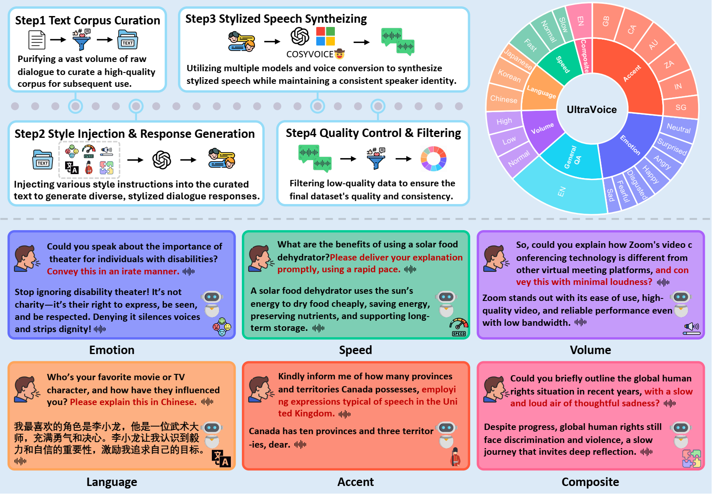
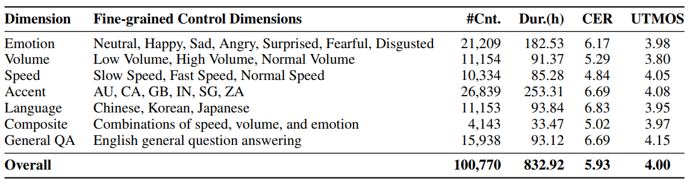
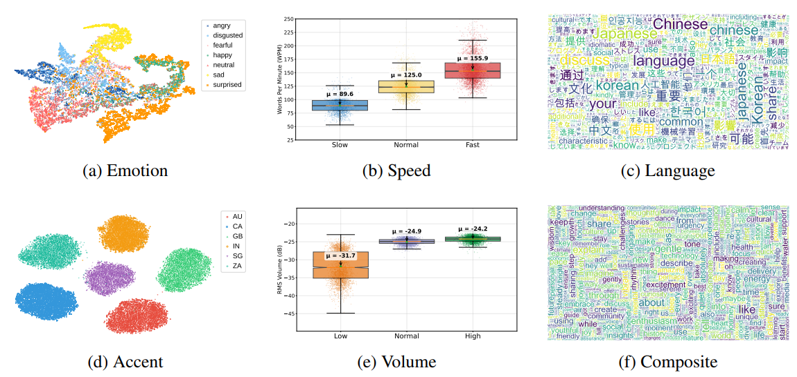
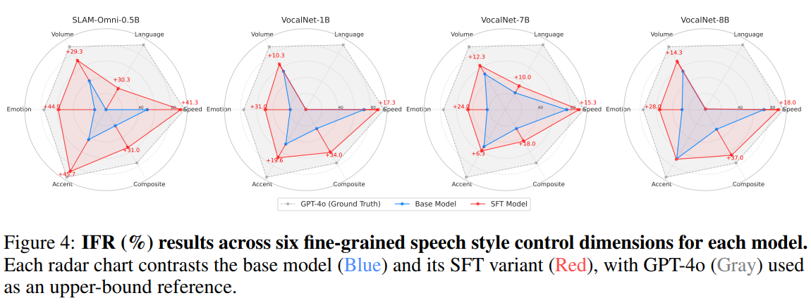
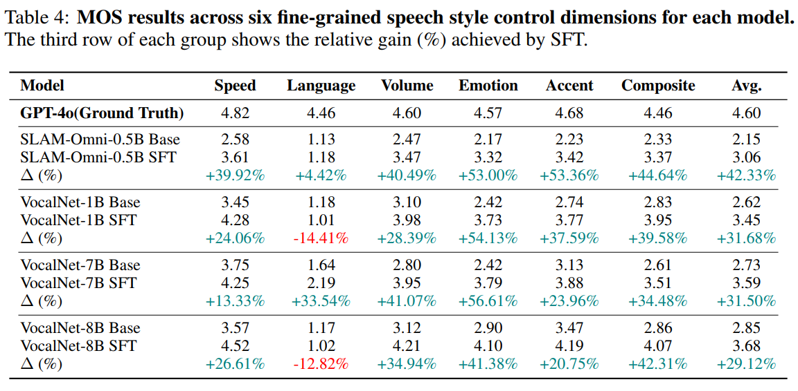
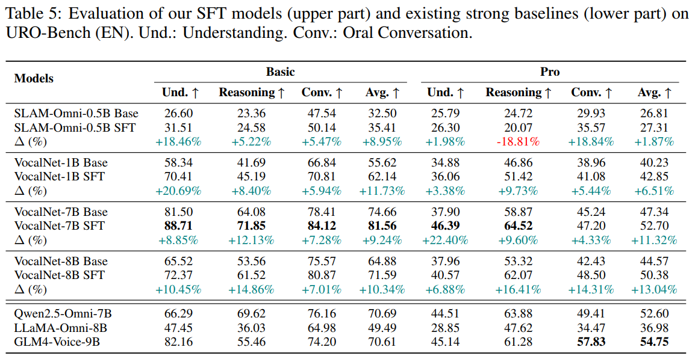
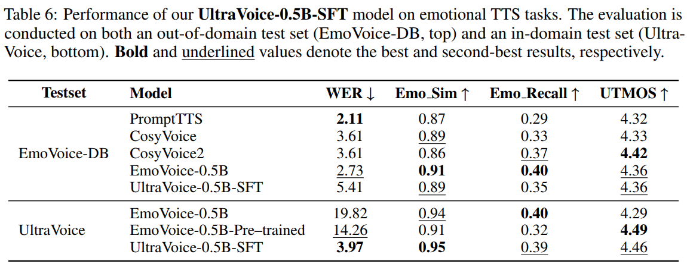
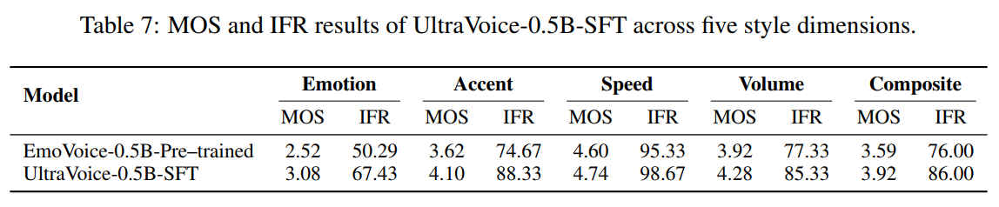

<div align="center">


# UltraVoice: Scaling Fine-Grained Style-Controlled Speech Conversations for Spoken Dialogue Models

[](https://arxiv.org/abs/XXXX.XXXXX) 
[](https://bigai-nlco.github.io/UltraVoice)
[](https://huggingface.co/datasets/tutu0604/UltraVoice)
[](https://huggingface.co/tutu0604/UltraVoice-SFT)
[](LICENSE)
</div>

> **⚠️ IMPORTANT NOTICE**: The official UltraVoice repository has been moved to [https://github.com/bigai-nlco/UltraVoice](https://github.com/bigai-nlco/UltraVoice)


## 📝 Abstract

> Spoken dialogue models currently lack the ability for fine-grained speech style control, a critical capability for human-like interaction that is often overlooked in favor of purely functional capabilities like reasoning and question answering. To address this limitation, we introduce **UltraVoice**, the first large-scale speech dialogue dataset engineered for multiple fine-grained speech style control. Encompassing over 830 hours of speech dialogues, UltraVoice provides instructions across six key speech stylistic dimensions: emotion, speed, volume, accent, language, and composite styles. Fine-tuning leading models such as SLAM-Omni and VocalNet on UltraVoice significantly enhances their fine-grained speech stylistic controllability without degrading core conversational abilities. Specifically, our fine-tuned models achieve improvements of 29.12-42.33% in Mean Opinion Score (MOS) and 14.61-40.09 percentage points in Instruction Following Rate (IFR) on multi-dimensional control tasks. Moreover, on the URO-Bench benchmark, our fine-tuned models demonstrate substantial gains in core understanding, reasoning, and conversational abilities, with average improvements of +10.84% on the Basic setting and +7.87% on the Pro setting. Furthermore, the dataset's utility extends to training controllable Text-to-Speech (TTS) models, underscoring its high quality and broad applicability for expressive speech synthesis.

## 🎯 Overview

<div align="center">
  
</div>

**Overview of the UltraVoice Dataset Construction and Stylistic Coverage.** The figure illustrates the complete pipeline and capabilities of UltraVoice: (1) The upper left section presents our four-step construction process: text corpus curation, style injection & response generation, stylized speech synthesis, and quality control & filtering. (2) The ring chart on the right visualizes the dataset's hierarchical control structure, with six main control dimensions in the inner ring (Emotion, Speed, Volume, Accent, Language, Composite) and their finer-grained sub-dimensions in the outer ring. (3) The lower panel showcases representative examples from each speech style dimension, demonstrating UltraVoice's rich stylistic coverage and multi-dimensional controllability, including emotion (e.g., angry, happy), speed (e.g., fast, slow), volume (e.g., high, low), language (e.g., Chinese, Japanese, Korean), accent (e.g., AU, CA, GB, IN, SG, ZA), and composite styles that combine multiple control attributes.

## 📊 Dataset
The **UltraVoice** dataset contains **100,770** high-quality spoken dialogue samples, totaling **832.92 hours** of audio.  
Among them, **84,832** are explicitly conditioned on six major fine-grained speech style dimensions:
- Emotion (Neutral, Happy, Sad, Angry, Surprised, Fearful, Disgusted)
- Volume (Low, Normal, High)
- Speed (Slow, Normal, Fast)
- Accent (AU, CA, GB, IN, SG, ZA)
- Language (Chinese, Japanese, Korean)
- Composite (multi-style combinations)

The remaining **15,938** pairs are general English QA samples to ensure balance and generalization.  
Average metrics indicate **mean CER of 5.93%** and **UTMOS 4.00**, showing high-quality, natural speech and stable stylistic control.

<div align="center">
  
</div>

**Detailed statistics across all control dimensions.** #Cnt. denotes the number of samples, Dur. represents the total duration in hours, CER indicates the average character error rate, and UTMOS measures the averaged naturalness score. The dataset encompasses 100,770 samples totaling 832.92 hours, with fine-grained control over emotion (7 categories), volume (3 levels), speed (3 levels), accent (6 regions: AU, CA, GB, IN, SG, ZA), language (Chinese, Korean, Japanese), and composite styles.

<div align="center">
  
</div>

**Statistical visualizations of the six fine-grained speech style control dimensions in UltraVoice.** The visualization methods are tailored to each dimension's characteristics: (a) **Emotion** and (d) **Accent** use t-SNE plots demonstrating clear class separability for categorical attributes; (b) **Speed** and (e) **Volume** employ box plots showing precise control over acoustic properties with distinct distributions; (c) **Language** and (f) **Composite** leverage word clouds highlighting lexical diversity and expressive richness across multilingual and multi-dimensional control scenarios.

## 🔧 Experiments

We fine-tuned **SLAM-Omni** and **VocalNet** series models (based on LLaMA and Qwen LLMs) using UltraVoice via **Supervised Fine-Tuning (SFT)** to assess both fine-grained speech style control and general conversational abilities.

### 1. Performance on Fine-Grained Speech Style Control

We evaluated our fine-tuned models on UltraVoice internal test sets using two key metrics: **Instruction Following Rate (IFR)** for measuring instruction compliance and **Mean Opinion Score (MOS)** for assessing subjective naturalness.

<div align="center">
  
</div>

**IFR (%) results across six fine-grained speech style control dimensions for each model.** Each radar chart contrasts the base model (Blue) and its SFT variant (Red), with GPT-4o (Gray) used as an upper-bound reference. Fine-tuning with UltraVoice significantly boosts instruction-following capability, with IFR gains ranging from **14.61 to 40.09 percentage points**. This improvement is particularly pronounced for smaller models with weaker baseline performance. For instance, the IFR of SLAM-Omni-0.5B surged from 28.30% to 68.39%, while VocalNet-1B's score increased from 36.28% to 55.91%.

<div align="center">
  
</div>

**MOS results across six fine-grained speech style control dimensions for each model.** The third row of each group shows the relative gain (%) achieved by SFT. All models exhibit significant improvements in MOS after being fine-tuned with UltraVoice. The relative gains range from **29.12% to 42.33%**, with the Emotion and Accent dimensions showing particularly remarkable improvements. For instance, the overall MOS for VocalNet-7B increased from 2.73 to 3.59, while VocalNet-8B's score rose from 2.85 to 3.68. These results indicate that our fine-tuning process enhances the models' ability to render the specified styles with high naturalness, demonstrating that improved instruction control does not come at the cost of audio quality.

### 2. General Conversational Ability

To verify that fine-tuning on UltraVoice enhances rather than compromises general conversational skills, we evaluated our models on **URO-Bench**, a comprehensive benchmark for spoken dialogue models.

<div align="center">
  
</div>

**Evaluation of our SFT models (upper part) and existing strong baselines (lower part) on URO-Bench (EN).** Und.: Understanding. Conv.: Oral Conversation. Our results confirm that fine-tuning spoken dialogue models on UltraVoice enhances, rather than compromises, general conversational skills. All models showed substantial gains across Understanding, Reasoning, and Oral Conversation, with average improvements of **+10.84%** on the Basic setting and **+7.87%** on the Pro setting. Notably, the VocalNet-7B SFT model achieves state-of-the-art performance, outperforming strong baselines like Qwen2.5-Omni-7B and GLM4-Voice-9B, highlighting practical value beyond style control.

### 3. Validation of Data Quality via Controllable Text-to-Speech

To further validate the quality and utility of our dataset, we repurposed UltraVoice into a controllable TTS dataset and fine-tuned a pre-trained **EmoVoice-0.5B** model, creating **UltraVoice-0.5B-SFT**.

<div align="center">
  
</div>

**Performance of our UltraVoice-0.5B-SFT model on emotional TTS tasks.** The evaluation is conducted on both an out-of-domain test set (EmoVoice-DB, top) and an in-domain test set (UltraVoice, bottom). Bold and underlined values denote the best and second-best results, respectively. Our fine-tuned TTS model demonstrates strong multi-dimensional style control. On the out-of-domain EmoVoice-DB test set, our model achieves competitive performance against strong baselines such as PromptTTS, CosyVoice, and EmoVoice. Crucially, on our in-domain UltraVoice data, it substantially reduces the Word Error Rate (WER) to **3.97** from 19.82, achieving high emotion similarity (**0.95**) and naturalness (**4.46** UTMOS).

<div align="center">
  
</div>

**MOS and IFR results of UltraVoice-0.5B-SFT across five style dimensions.** The model consistently improves both MOS and IFR scores across all tested dimensions (emotion, accent, speed, volume, and composite styles) compared to the pre-trained baseline. These results confirm that our instruction-style data effectively enhances controllable synthesis across a diverse range of styles, demonstrating the high quality and broad applicability of UltraVoice for expressive speech synthesis tasks.

---

## 🧩 Model Checkpoints

All fine-tuned models and datasets are released on 🤗HuggingFace: 
- [🤗 UltraVoice Dataset](https://huggingface.co/datasets/tutu0604/UltraVoice)
- [🤗 UltraVoice-SFT Models](https://huggingface.co/tutu0604/UltraVoice-SFT)

## 📄 License

This project is licensed under the `MIT License` - see the [LICENSE](LICENSE) file for details.

## 📖 Citation

If you find this work useful in your research, please consider citing:

```bibtex

```


## 🙏 Acknowledgements

This work builds upon several outstanding projects and research contributions:

- **[SLAM-LLM](https://github.com/X-LANCE/SLAM-LLM)**: We are grateful to the SLAM-LLM framework for providing a robust toolkit for speech and audio processing with large language models, which served as a foundation for our model training infrastructure.

- **[SLAM-Omni](https://arxiv.org/abs/2412.15649)**: We acknowledge the SLAM-Omni work for pioneering timbre-controllable voice interaction systems and demonstrating effective single-stage training approaches.

- **[VocalNet](https://arxiv.org/abs/2504.04060)**: We thank the VocalNet team for their innovative multi-token prediction approach for speech LLMs, which inspired our baseline model selection and evaluation.

- **[EmoVoice](https://arxiv.org/abs/2504.12867)**: We appreciate the EmoVoice project for advancing emotional text-to-speech synthesis with LLM-based approaches, which informed our controllable TTS validation experiments.

- **[URO-Bench](https://arxiv.org/abs/2502.17810)**: We are grateful for the URO-Bench benchmark, which provided a comprehensive evaluation framework for assessing the general conversational abilities of our fine-tuned spoken dialogue models.

We also thank the open-source community for their valuable tools and datasets that made this research possible.
